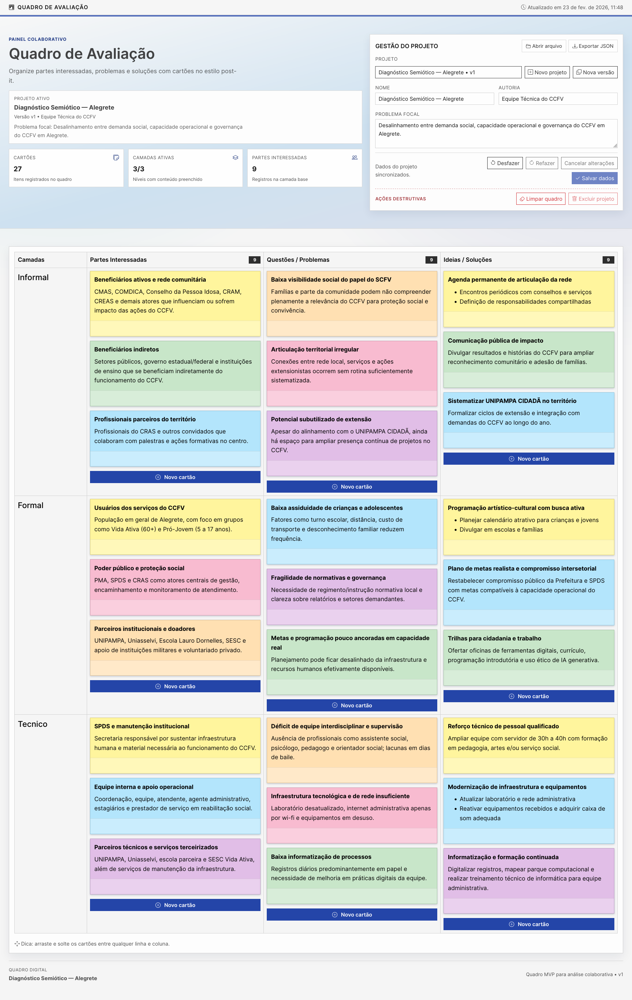

# Quadro de Avaliação

Uma aplicação moderna para construção e organização de quadros de avaliação diagnóstica, com cartões editáveis por célula e exportação/importação de projetos em JSON.

## Screenshot



## Funcionalidades

- Gestão de projetos e versões de quadro
- Edição de cartões com texto rico (Rich Text)
- Organização por colunas e linhas com arrastar e soltar
- Troca de cor dos cartões (estilo post-it)
- Exportação e importação do quadro em JSON

## Tech Stack

- **React** com **TypeScript**
- **Vite** para build e ambiente de desenvolvimento
- **SCSS** + **Bootstrap 5** para estilos
- **React Quill** para edição de texto rico

## Getting Started

```bash
# Instalar dependências
npm install

# Rodar em desenvolvimento
npm run dev

# Build de produção
npm run build

# Visualizar build
npm run preview
```
